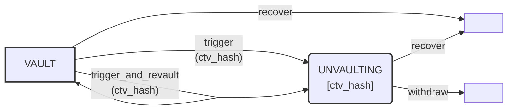

# Introduction

MATT allows to define on-chain protocols in the UTXO model by using the covenant encumbrance.

In such protocols, the UTXOs themselves contain the _state_ of the contract. The state is updated by spending some UTXOs and producing new UTXOs with a different state - with rules that are encoded in the UTXO itself.

This page documents the general framework that is used in the demos.

See [checkcontractverify.md](checkcontractverify.md) for the semantics of `OP_CHECKCONTRACTVERIFY` and the concept of _augmented_ UTXOs.

## Contracts, programs and clauses

The internal pubkey (or the _naked_ pubkey for an augmented P2TR), together with the taptree, constitutes the ___program___ of the contract, which encodes all the spending conditions of the contract.

An actual UTXO whose `scriptPubKey` is a program, possibly with some specified embedded _data_, is a ___contract instance___.

We call ___clause___ each of the spending conditions in the taptree of. Each clause might also specify the state transition rules, by defining the program of one or more of the outputs.<br>
The keypath, if not a NUMS (Nothing-Up-My-Sleeve) point, can also be considered an additional special clause with no condition on the outputs.

### Merklelized data

While the embedded _data_ of the contract is a 32-byte value, it is always possible to represent arbitrary collections of value and use the 32-byte slot to store a _commitment_ to the data.

We can think as a contract instance as a UTXO that _stores_ some arbitrary state. The exact representation of the state is an implementation detail, but here are some rules of thumb:

- A single 32-byte value is stored as-is.
- For a single value that is not 32-bytes long, the SHA256 hash is the embedded data.
- If multiple values are part of the contract state, they can be encoded as the leaves of a [Merkle tree](https://en.wikipedia.org/wiki/Merkle_tree), and only the root hash is stored.

___Remark___: other ways of committing to a collection of values are possible, and sometimes more efficient. For example, _the SHA256-hash of the concatenation of the SHA256-hashes of the elements_ is indeed more efficient than Merkle trees if all the values need to be revealed anyway. Care is necessary as __not all ways of concatenating/hashing a collection of elements are safe__, as some are prone to collisions.

## Smart contracts as finite state machines

Clauses of a contract can specify that certain outputs must be certain other contracts, and their embedded data.

This allows to represent UTXO-based smart contract protocols as finite state machines, where each node represents a contract, and its clauses specify the transitions to 0 or more other contracts.

For many constructions, spending the UTXO of a contract produces one or more pre-determined contracts as its output UTXOs. In this case, the resulting diagram is acyclic and is (or can be reduced to) a *Directed Acyclic Graph* (DAG)

Some contracts might have an output with the _same_ contract as the input being spent. In that case, the diagram is not a DAG, but only loops from a node to itself are allowed; this avoids impossible hash cycles.

Here's an example of a [vault](https://github.com/Merkleize/pymatt/tree/master/examples/vault):



***Remark***: this diagram represents the possible states and transitions of each individual UTXO. For some construction, the entire smart contract resides in a single UTXO; however, other constructions might require the existence of multiple UTXOs, which could interact in some spending conditions.

## Definitions

In this section we will define a pseudocode notation to describe MATT contracts.

Naming conventions:
  - _parameters_: decided at contract creation time, hardcoded in the Script.
  - _variables_: data stored in the UTXO instance, accessible to Script via `OP_CHECKCONTRACTVERIFY`.
  - _arguments_: passed via the witness during transitions (script spending paths)


We represent a contract with the following notation:

```
ContractName{params}[vars]
```

where:
  - `ContractName`, in camelcase, is the name of the contract
  - `params`: the compile-time list of parameters of the contract
  - `vars`: the list of variables (concretely stored in the data commitment of the covenant, aka the _state_ of the contract)

`params` and `vars` should be omitted if empty. Moreover, for notational simplicity we prefer to omit (and list separately) the *global* parameters that are unchanged for all the contracts in the diagram.

We call *clause* each spending condition of a contract. Each clause has a name (in lowercase, in snake_case if multiple words)

Transition notation:
```
    clause_name(args) => out_i: Contract{contract_params}[contract_vars]
```
if only a single output contract is produced by this clause, or:

```
    clause_name(args) => [
        out1_i: Contract1{contract1_params}[contract1_vars],
        out2_i: Contract2{contract2_params}[contract2_vars]
    ]
```

`out_i` is the index of the output that must match the contract. If omitted (allowed for at most one of the outputs), it must be equal to the input index being spent.


where:
 - `args`: the arguments of the clause, passed via the witness stack.
 - `=> Contract...` the destination contract of this clause. Omitted if the spending condition is not encumbered by the covenant. `contract_params` can only depend on the `params` of the current contract. `contract_vars` can depend on the `params` and the `vars` of the current contract, and also on the argument `args`.
 
The spending condition can be any predicate that can be expressed in Script, with access to all the `params`, `vars` and `args`.

_Note_: this ignores the technical details of how to encode/decode the state variables to/from a single hash; that is an implementation detail that can safely be left out when discussing the semantic of a smart contract.

### Default contract

The contract `P2TR{pk}` is equal to the output script descriptor `tr(pk)`.

### Example: Vault

With the above conventions, we can model the Vault contract drawn above as follows:

Global parameters:
  - `unvault_pk`: a public key that can start trigger a withdrawal
  - `spend_delay`: the number of blocks triggered coins have to wait before the final withdrawal
  - `recover_pk`: a public key for a P2TR address that coins will be sent to if the *recover* clause is used.


```
global unvault_pk
global recover_pk
global spend_delay


Vault:
  trigger(ctv_hash, out_i) => [out_i: Unvaulting[ctv_hash]]:
    checksig(unvault_pk)

  trigger_and_revault(ctv_hash, revault_out_i, trigger_out_i) => [
    deduct revault_out_i: Vault,
    trigger_out_i: Unvaulting[ctv_hash]
  ]:
    checksig(unvault_pk)

  recover => P2TR{recover_pk}:
    pass


Unvaulting[ctv_hash]:
  withdraw:
    older(spend_delay)
    ctv(ctv_hash)

  recover => P2TR{recover_pk}:
    pass
```

A matching Python implementation can be found in [vault_contracts.py](../examples/vault/vault_contracts.py).
